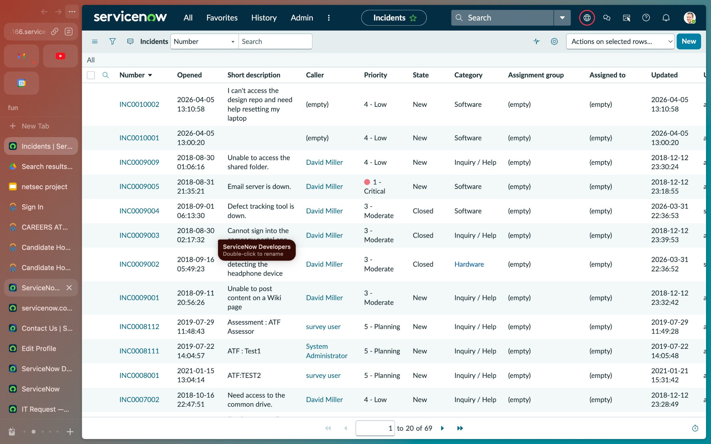
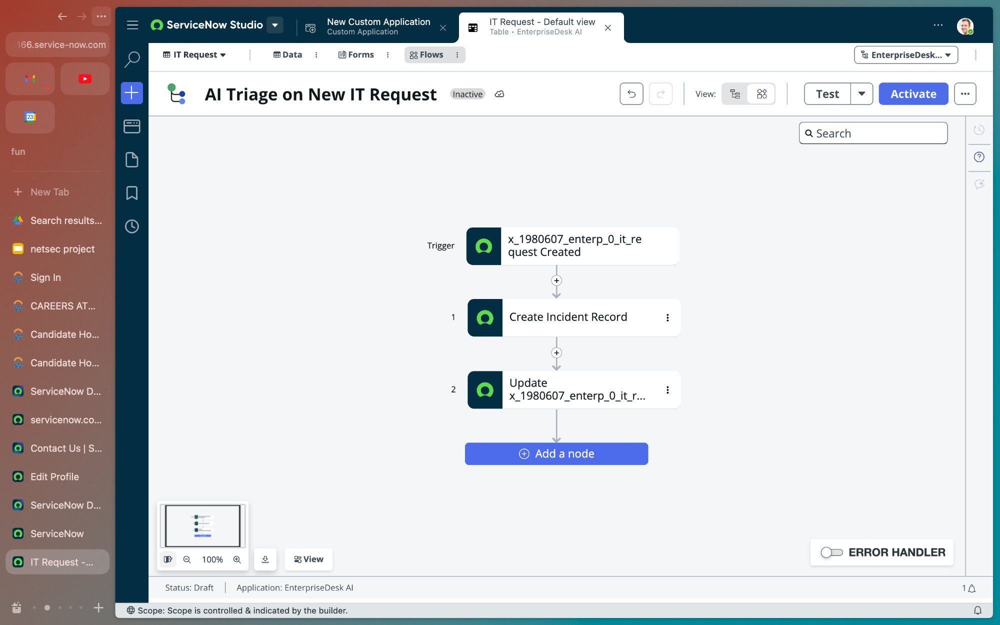
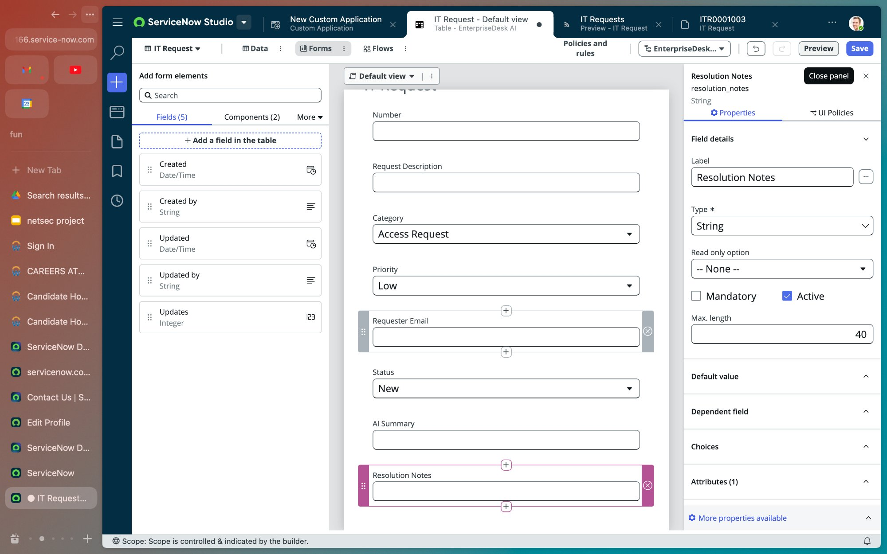
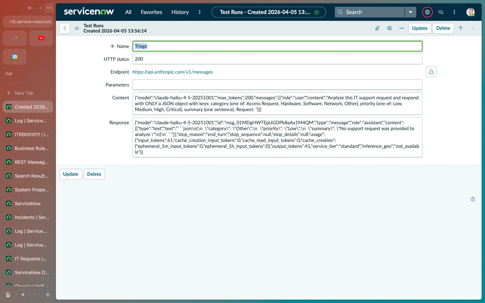

# EnterpriseDesk AI 🤖

An agentic IT helpdesk system built on **ServiceNow PDI**, powered by **Claude AI** — automatically triages incoming IT requests, creates incidents, and notifies teams via Slack.

> Built to demonstrate enterprise AI implementation skills for roles at Moveworks / ServiceNow.

---

## Demo

### Slack Notification — End-to-End Working


### ServiceNow Incidents Auto-Created


### Flow Designer Pipeline


### IT Request Form


### Claude API Test — HTTP 200


---

## What It Does

When an employee submits an IT Request, the system automatically:

1. **Receives** the request via a custom ServiceNow form
2. **Calls Claude AI** to analyze the request description
3. **Classifies** the request — Category, Priority, and generates an AI Summary
4. **Creates a ServiceNow Incident** linked to the original request
5. **Notifies the team** via Slack with full triage details

All of this happens within seconds, with zero human intervention.

---

## Architecture

```
Employee submits IT Request (ServiceNow Form)
        │
        ▼
Flow Designer Trigger (on record insert)
        │
        ├──► Create Incident Record (ServiceNow Incident table)
        │
        └──► Update IT Request Status → "In Progress"
        
        +

Business Rule: Claude AI Triage (async, on insert)
        │
        ▼
Outbound REST Message → Anthropic API (Claude Haiku)
        │
        ▼
Parse AI Response → Category + Priority + Summary
        │
        ├──► Update IT Request fields
        │
        └──► Outbound REST → Slack Webhook (team notification)
```

---

## Tech Stack

| Layer | Technology |
|---|---|
| Platform | ServiceNow PDI (Australia release) |
| AI Model | Claude Haiku (Anthropic API) |
| Automation | ServiceNow Flow Designer |
| Business Logic | ServiceNow Business Rules (server-side JS) |
| Integrations | Outbound REST Messages |
| Notifications | Slack Incoming Webhooks |
| App Scope | Custom scoped app — EnterpriseDesk AI |

---

## ServiceNow Components Built

### Custom App: EnterpriseDesk AI
Scoped application (`x_1980607_enterp_0`) containing all components.

### IT Request Table
Custom table with fields:
- `request_description` — String (500 chars)
- `category` — Choice (Access Request, Hardware, Software, Network, Other)
- `priority` — Choice (Low, Medium, High, Critical)
- `status` — Choice (New, In Progress, Resolved, Closed)
- `requester_email` — String
- `ai_summary` — String (AI-generated)
- `resolution_notes` — String

### Flow Designer — AI Triage on New IT Request
Trigger: Record Created on IT Request table
- **Node 1:** Create Incident Record (maps description → short_description)
- **Node 2:** Update IT Request status → In Progress

### Business Rule — Claude AI Triage
- **When:** Async, on Insert
- **Logic:** Calls Claude API via outbound REST, parses JSON response, updates record fields, fires Slack notification

### Outbound REST Messages
- **Claude Anthropic API** — POST to `https://api.anthropic.com/v1/messages`
- **Slack Notification** — POST to Slack Incoming Webhook

---

## Setup Instructions

### Prerequisites
- ServiceNow Personal Developer Instance (free at [developer.servicenow.com](https://developer.servicenow.com))
- Anthropic API key ([console.anthropic.com](https://console.anthropic.com))
- Slack workspace with Incoming Webhooks enabled

### Installation

1. **Import the Update Set**
   - In your ServiceNow instance, go to `System Update Sets > Retrieved Update Sets`
   - Click `Import Update Set from XML`
   - Upload `EnterpriseDesk_AI_v1.0.xml`
   - Preview and Commit the update set

2. **Configure API Keys**
   - Go to `REST Messages > Claude Anthropic API > Triage HTTP Method`
   - Update the `x-api-key` header with your Anthropic API key
   - Go to `REST Messages > Slack Notification`
   - Update the endpoint with your Slack webhook URL

3. **Activate the Business Rule**
   - Go to `Business Rules > Claude AI Triage`
   - Verify it is Active and set to async/Insert

4. **Test**
   - Navigate to your IT Request table
   - Submit a new record with a plain-language description
   - Wait ~15 seconds and refresh — Category, Priority, and AI Summary should be auto-filled
   - Check your Slack channel for the notification

---

## Key Technical Concepts Demonstrated

**Slot Resolution** — The AI converts ambiguous natural language ("can't connect to WiFi") into structured API-friendly values (Category: Network, Priority: High) before writing to the database. This mirrors Moveworks' core Agentic Automation Engine behavior.

**Agentic Workflow Design** — The system chains multiple actions autonomously: intake → AI classification → incident creation → status update → team notification. No human in the loop for routine requests.

**Enterprise Integration Patterns** — Uses ServiceNow's native outbound REST framework (not inline HTTP calls) for secure, auditable external API calls — the production-grade approach.

**Failure Handling** — Business rule wrapped in try/catch with `gs.error` logging. AI response parsing strips markdown code fences before JSON.parse to handle model output variability.

---

## Failure Modes & Edge Cases

| Scenario | Handling |
|---|---|
| Claude API down | try/catch catches exception, logs to syslog, record saved without AI fields |
| Claude returns malformed JSON | Regex strips markdown fences before parse; if still fails, caught by try/catch |
| Slack webhook fails | Separate try/catch could be added; currently logged as part of main error handler |
| Empty request description | Claude returns Other/Low with note "no request provided" |
| ServiceNow PDI sleeping | Outbound REST times out; Business Rule logs timeout error |

---

## Project Status

- [x] Custom IT Request table + form
- [x] Flow Designer automation (Incident creation)
- [x] Claude AI triage (category, priority, summary)
- [x] Slack notifications
- [ ] Admin dashboard (request volume, category breakdown)
- [ ] GitHub Actions CI for update set validation
- [ ] Multi-language support via Claude translation

---

## Author

**Anusha Seshadri**  
MS Data Science, Rochester Institute of Technology  
[LinkedIn](https://linkedin.com/in/anusha-seshadri) | [GitHub](https://github.com/Anusha19011901)

---

*Built as a portfolio project demonstrating enterprise agentic AI implementation on ServiceNow — the same platform powering Moveworks' AI Assistant.*
